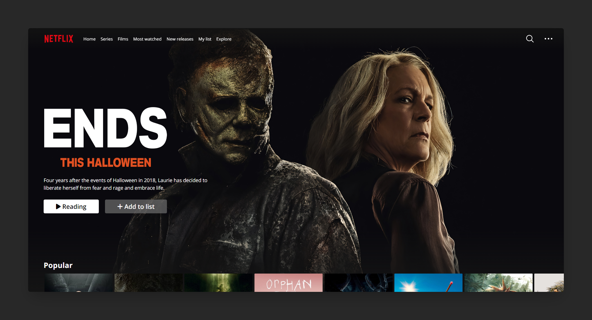

# Netflix integration with React ⚛

I'm trying to recreate the Netflix platform without a Figma model and only with React. For the movie database, I use [Themoviedb API](https://www.themoviedb.org/) (not integrated for the moment in the project).

## To do

- [x] Navbar
- [x] Header
- [x] API Fetch
- [x] Movie list
- [ ] Carousel
- [ ] Responsive

### Optional tasks

- [ ] Other pages
- [ ] Research
- [ ] Information on click
- [ ] ...

## Link 

Here you can see [the deployed project.](https://react-netflix-vvkdo.netlify.app/)

## React components

- [Axios](https://www.npmjs.com/package/axios)
- [React Router V6](https://reactrouter.com/en/main)